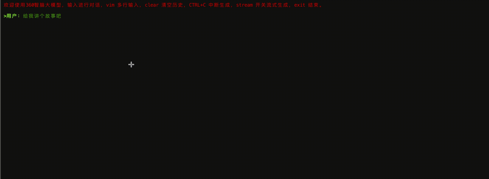
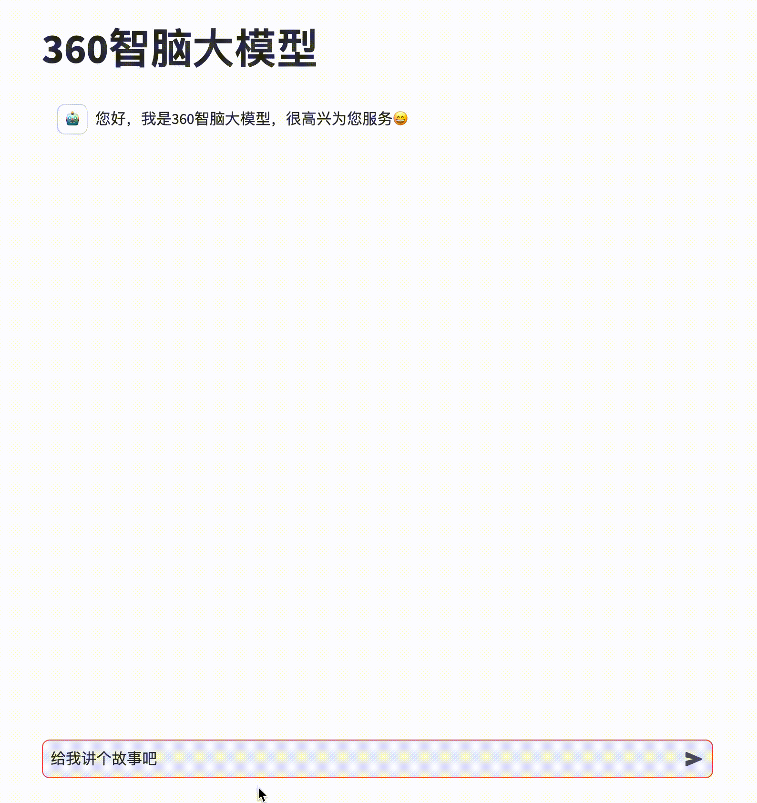

<p align="left">
    中文 ｜ &nbsp <a href="./README.md">English</a></a>&nbsp
</p>
<br>

<div align="center">
<h1>
  360智脑
</h1>
</div>
<div align="center">
    🤗 <a href="https://huggingface.co/qihoo360">Hugging Face</a>&nbsp&nbsp | &nbsp&nbsp
    🤖 <a href="https://modelscope.cn/organization/360zhinao">ModelScope</a>&nbsp&nbsp ｜ &nbsp&nbsp
    💬 <a href="./assets/WeChat.png">WeChat (微信)</a>&nbsp&nbsp
</div>
<br>
<p align="center">
 欢迎访问360智脑官网<a href="https://ai.360.com"> https://ai.360.com </a>体验更多更强大的功能。
</p>

<br>

# 模型介绍
 🎉🎉🎉我们开源了360智脑大模型的系列工作，本次开源了以下模型：
 - **360Zhinao2-7B-Base**
 - **360Zhinao2-7B-Chat-4K**
 - **360Zhinao2-7B-Chat-32K**
 - **360Zhinao2-7B-Chat-360K**

360智脑大模型特点如下：
- **基础模型**：采⽤当前主流的两阶段训练⽅法，第⼀阶段采用cosine学习率总共训练10T
token，第二阶段我们加⼤了⾼质量数据的占⽐，训练了100B⾼质量token，学习率LR直接decay到0。**360Zhinao2-7B总共训练数据量达10.1T token**。
- **对话模型**：具有强大的对话能力，开放4K、32K、360K三种不同文本长度。

<br>

# 更新信息
- [2024.11.18] 🔥🔥🔥我们发布了360Zhinao2-7B，同时开放Base模型和4K、32K、360K三种文本长度的Chat模型。
- [2024.05.23] 我们发布了360Zhinao-search以及360Zhinao-1.8B-Reranking两个模型，分别在[C-MTEB 榜单](https://huggingface.co/spaces/mteb/leaderboard)的Retrieval和Reranking任务上排名第一。
- [2024.05.20] 我们将llama3的窗口长度扩展到360k并发布了**llama3-8B-360Zhinao-360k-Instruct**<a href="https://huggingface.co/qihoo360/llama3-8B-360Zhinao-360k-Instruct">🤗</a>
- [2024.04.12] 我们发布了360Zhinao-7B 1.0版本，同时开放Base模型和4K、32K、360K三种文本长度的Chat模型。
技术报告详见[arXiv](https://arxiv.org/abs/2405.13386)。

<br>

# 目录
- [下载地址](#下载地址)
- [模型评估](#模型评估)
- [快速开始](#快速开始)
- [模型推理](#模型推理)
- [模型微调](#模型微调)
- [许可证](#许可证)

<br>

# 下载地址
本次发布版本和下载链接见下表：
| Size | Model | BF16 | Int4|
|:-:|-|:-:|:-:|
| 7B | 360Zhinao2-7B-Base | <a href="https://modelscope.cn/models/360zhinao/360Zhinao2-7B-Base/summary">🤖</a>  <a href="https://huggingface.co/qihoo360/360Zhinao2-7B-Base">🤗</a> |  |
| 7B | 360Zhinao2-7B-Chat-4K | <a href="https://modelscope.cn/models/360zhinao/360Zhinao2-7B-Chat-4K/summary">🤖</a>  <a href="https://huggingface.co/qihoo360/360Zhinao2-7B-Chat-4K">🤗</a> | <a href="https://modelscope.cn/models/360zhinao/360Zhinao2-7B-Chat-4K-Int4/summary">🤖</a>  <a href="https://huggingface.co/qihoo360/360Zhinao2-7B-Chat-4K-Int4">🤗</a> |
| 7B | 360Zhinao2-7B-Chat-32K | <a href="https://modelscope.cn/models/360zhinao/360Zhinao2-7B-Chat-32K/summary">🤖</a>  <a href="https://huggingface.co/qihoo360/360Zhinao2-7B-Chat-32K">🤗</a> | <a href="https://modelscope.cn/models/360zhinao/360Zhinao2-7B-Chat-32K-Int4/summary">🤖</a>  <a href="https://huggingface.co/qihoo360/360Zhinao2-7B-Chat-32K-Int4">🤗</a> |
| 7B | 360Zhinao2-7B-Chat-360K | <a href="https://modelscope.cn/models/360zhinao/360Zhinao2-7B-Chat-360K/summary">🤖</a>  <a href="https://huggingface.co/qihoo360/360Zhinao2-7B-Chat-360K">🤗</a> | <a href="https://modelscope.cn/models/360zhinao/360Zhinao2-7B-Chat-360K-Int4/summary">🤖</a>  <a href="https://huggingface.co/qihoo360/360Zhinao2-7B-Chat-360K-Int4">🤗</a> |

<br>

# 模型评估

## 基础模型

我们使⽤了开源⼯具opencompass对模型进⾏评估，对⽐了近半年国内外开源的10B以下模型，
360Zhinao2-7B具备较强的竞争⼒。360Zhinao2-7B在CEval（中⽂
考试）、C3（中⽂阅读理解）、lcsts（中⽂短⽂本摘要）等中⽂benchmark上表现不俗，中⽂
benchmark均分排名第⼀。在挑战性的竞赛数学数据集math上，同样排名第⼀。**360Zhinao2-7B模
型在中⽂处理能⼒、复杂数学推理能⼒两个⽅⾯，具备优势。**

<table>
	<tr>
	    <td>Type</td><td>Datasets</td><td>language</td><td>glm4-9b</td><td>Qwen2.5-7B</td><td>internlm2.5-7b</td><td>Yi1.5-9B</td><td>gemma2-9b</td><td>Llama3.1-8B</td><td>360Zhinao2-7B</td>
	</tr>
	<tr>
	    <td rowspan="5">Exam</td><td>ceval</td><td>zh</td><td>75.83</td><td>81.41</td><td>77.71</td><td>73.51</td><td>56.36</td><td>51.67</td><td><strong>83.04</strong></td>
	</tr>
    <tr>
        <td>mmlu</td><td>en</td><td>75.5</td><td>75.5</td><td>71.55</td><td>71.43</td><td>72.22</td><td>66.75</td><td>67.84</td>
    </tr>
    <tr>
        <td>cmmlu</td><td>zh</td><td>74.24</td><td>81.79</td><td>78.77</td><td>74.2</td><td>58.89</td><td>52.49</td><td>73.8</td>
    </tr>
    <tr>
        <td>ARC-c</td><td>en</td><td>94.92</td><td>80</td><td>85.08</td><td>87.46</td><td>77.63</td><td>80.68</td><td>87.12</td>
    </tr>
    <tr>
        <td>ARC-e</td><td>en</td><td>98.41</td><td>84.83</td><td>95.24</td><td>94.53</td><td>78.84</td><td>89.77</td><td>92.77</td>
    </tr>
    <tr>
        <td rowspan="2">Language</td><td>WiC</td><td>en</td><td>51.57</td><td>52.82</td><td>50.78</td><td>50.63</td><td>50.47</td><td>50</td><td>49.84</td>
    </tr>
    <tr>
        <td>WSC</td><td>en</td><td>68.27</td><td>68.27</td><td>69.23</td><td>66.35</td><td>68.27</td><td>67.31</td><td>65.38</td>
    </tr>
    <tr>
        <td rowspan="2">Knowledge</td>
        <td>BoolQ</td><td>en</td><td>81.8</td><td>83.88</td><td>89.51</td><td>84.46</td><td>85.6</td><td>82.2</td><td>88.29</td>
    </tr>
    <tr>
        <td>commonsense_qa</td><td>en</td><td>71.17</td><td>73.22</td><td>68.55</td><td>71.58</td><td>68.47</td><td>71.25</td><td>69.78</td>
    </tr>
    <tr>
        <td rowspan="6">Understanding</td>
        <td>C3</td><td>zh</td><td>91.51</td><td>92</td><td>93.04</td><td>85.86</td><td>81.64</td><td>83.51</td><td><strong>93.26</strong></td>
    </tr>
    <tr>
        <td>race-middle</td><td>en</td><td>91.99</td><td>91.02</td><td>92.06</td><td>91.16</td><td>88.09</td><td>81.69</td><td>90.46</td>
    </tr>
    <tr>
        <td>race-high</td><td>en</td><td>90.71</td><td>87.91</td><td>90.08</td><td>88.34</td><td>82.08</td><td>78.73</td><td>86.74</td>
    </tr>
    <tr>
        <td>lcsts</td><td>zh</td><td>18.29</td><td>15.82</td><td>15.96</td><td>16.49</td><td>10.62</td><td>17.29</td><td><strong>18.61</strong></td>
    </tr>
    <tr>
        <td>eprstmt-dev</td><td>zh</td><td>91.88</td><td>86.88</td><td>91.25</td><td>91.88</td><td>48.12</td><td>83.12</td><td>90</td>
    </tr>
    <tr>
        <td>lambada</td><td>en</td><td>71.67</td><td>71.14</td><td>69.98</td><td>70.64</td><td>75.43</td><td>74.23</td><td>72.56</td>
    </tr>
    <tr>
        <td rowspan="3">Reasoning</td>
        <td>hellaswag</td><td>en</td><td>70.25</td><td>72.76</td><td>70.38</td><td>71.55</td><td>66.83</td><td>74.65</td><td>71.49</td>
    </tr>
    <tr>
        <td>siqa</td><td>en</td><td>81.73</td><td>72.52</td><td>78.97</td><td>76.2</td><td>58.96</td><td>64.18</td><td>77.12</td>
    </tr>
    <tr>
        <td>bbh</td><td>en</td><td>73.68</td><td>54.63</td><td>59.43</td><td>67.86</td><td>68.45</td><td>59.9</td><td>46.54</td>
    </tr>
    <tr>
        <td rowspan="2">Code</td>
        <td>humaneval</td><td>en</td><td>69.51</td><td>75</td><td>60.37</td><td>26.22</td><td>5.49</td><td>27.44</td><td>60.98</td>
    </tr>
    <tr>
        <td>mbpp</td><td>en</td><td>60</td><td>60</td><td>43.6</td><td>56.8</td><td>51.2</td><td>42.6</td><td>54</td>
    </tr>
    <tr>
        <td rowspan="2">Math</td>
        <td>math</td><td>en</td><td>26.86</td><td>38</td><td>27.14</td><td>27.06</td><td>28.52</td><td>15.32</td><td><strong>38.34</strong></td>
    </tr>
    <tr>
        <td>gsm8k</td><td>en</td><td>78.54</td><td>79.76</td><td>52.54</td><td>71.11</td><td>73.09</td><td>56.25</td><td>75.51</td>
    </tr>
    <tr>
        <td rowspan="2">Overall</td>
        <td>avg_zh</td><td></td><td>70.35</td><td>71.58</td><td>71.35</td><td>68.39</td><td>51.13</td><td>57.62</td><td><strong>71.74</strong></td>
    </tr>
    <tr>
        <td>avg_all</td><td></td><td>73.11</td><td>71.78</td><td>69.60</td><td>68.88</td><td>61.60</td><td>62.32</td><td>70.61</td>
    </tr>
</table>


## Chat模型

### 后训练数据
高质量微调数据50w，该数据综合考虑大模型通用技能及360垂直业务数据，生成方法如下：
   1. 数据多样性：根据360自有标签体系进行领域，意图，难度，长度的分层采样，确保指令多样性
   2. 数据质量：使用偏序数据训练360gpt-pro-rm（reward bench得分92.59），用该模型进行样本筛选，过滤掉低质数据
   3. 复杂指令进化：使用进化方式做复杂指令优化，优化指令跟随能力

### 训练方法
1. 全参数微调

    基于通用后训练数据，进行全参数微调,选择最优checkpoint作为sft-base。

2. Lora offline DPO强化

    使用人类标注好的偏好pair对，采用Lora方法对sft-base进行lora微调，然后进行lora DPO训练。

3. Iterative on-policy DPO 全参数强化

    使用sft-base模型在训练prompt上采样多个答案，用360gpt-pro-rm打分，取最高最低分组pair进行DPO训练。我们迭代地使用这种on-policy DPO提升模型效果。

4. 模型合并
    
    在360公司白盒评测集合4上，针对上述3个模型做自动评测，发现不同模型各有其优势技能，考虑模型合并方案，得到最终的Chat模型.

### 模型效果
   我们在IFEval、MT-bench、CF-Bench三个经典任务上对 360Zhinao2-7B-Chat-4k 模型进行了评测，模型效果具备较强竞争力。IFEval (prompt strict) 仅次于GLM4-9B,在7B开源模型中得分最高，详细结果如下表:

| Model                | MT-bench | IFEval(strict prompt) | CFBench(CSR,ISR,PSR) |      |      |
|----------------------|----------|-----------------------|----------------------|------|------|
| Qwen2.5-7B-Instruct  | **8.07** | 0.556                 | **0.81**             | 0.46 | 0.57 |
| Yi-9B-16k-Chat       | 7.44     | 0.455                 | 0.75                 | 0.4  | 0.52 |
| GLM4-9B-Chat         | **8.08** | **0.634**             | **0.82**             | 0.48 | 0.61 |
| InternLM2.5-7B-Chat  | 7.39     | 0.540                 | 0.78                 | 0.4  | 0.54 |
| 360Zhinao2-7B-Chat-4k| 7.86     | **0.577**             | 0.8                  | 0.44 | 0.57 |


### 长文本微调
与360Zhinao1开源时的做法基本一致，我们将RoPE base依次扩大为1000,000和50,000,000，混合长短文本的SFT数据依次拼接至32k和360k，将gradient checkpointing、ZeRO3 offload和ring attention等技术结合，依次微调得到32k和360k长文本模型。在各个32k benchmark上位列第一梯队。

| Model                        | LooGLE-长依赖QA | Loong-Set 1 (32k) | LongBench-Chat (32k截断) | LEval-96题子集胜率 | LEval-客观题均分 |
|------------------------------|-----------------|-------------------|--------------------------|--------------------|------------------|
| GLM4-9B-Chat                 | 0.36            | 55.24             | 6.60                     | 0.49               | 63.96            |
| InternLM2.5-7B-Chat          | 0.39            | 42.76             | 5.70                     | 0.44               | 61.64            |
| 360Zhinao2-7B-Chat-32k       | 0.33            | 39.37             | 5.44                     | 0.44               | 60.48            |
| 360Zhinao2-7B-Chat-360k      | 0.34            | 32.16             | 5.08                     | 0.38               | 53.00            |
| Yi-1.5-9B-Chat               | 0.25            | 32.77             | 4.70                     | 0.37               | 56.22            |

<br>


# 快速开始
简单的示例来说明如何利用🤖 ModelScope和🤗 Transformers快速使用360Zhinao2-7B-Base和360Zhinao2-7B-Chat

## 依赖安装
- python 3.8 and above
- pytorch 2.0 and above
- transformers 4.37.2 and above
- CUDA 11.4 and above are recommended.

```shell
pip install -r requirements.txt 
```
我们推荐安装flash-attention（当前已支持flash attention 2）来提高你的运行效率以及降低显存占用。(flash-attention只是可选项，不安装也可正常运行该项目)

>flash-attn >= 2.3.6
```shell
FLASH_ATTENTION_FORCE_BUILD=TRUE pip install flash-attn==2.3.6
```


## 🤗 Transformers
### Base模型推理

此代码演示使用transformers快速使用360Zhinao2-7B-Base模型进行推理
```python
from transformers import AutoTokenizer, AutoModelForCausalLM
from transformers.generation import GenerationConfig

MODEL_NAME_OR_PATH = "qihoo360/360Zhinao2-7B-Base"

tokenizer = AutoTokenizer.from_pretrained(
    MODEL_NAME_OR_PATH, 
    trust_remote_code=True)

model = AutoModelForCausalLM.from_pretrained(
    MODEL_NAME_OR_PATH,
    device_map="auto",
    trust_remote_code=True)

generation_config = GenerationConfig.from_pretrained(
    MODEL_NAME_OR_PATH,
    trust_remote_code=True)

inputs = tokenizer('中国二十四节气\n1. 立春\n2. 雨水\n3. 惊蛰\n4. 春分\n5. 清明\n', return_tensors='pt')
inputs = inputs.to(model.device)

pred = model.generate(input_ids=inputs["input_ids"], generation_config=generation_config)
print("outputs:\n", tokenizer.decode(pred.cpu()[0], skip_special_tokens=True))
```

### Chat模型推理

此代码演示使用transformers快速使用360Zhinao2-7B-Chat-4K模型进行推理
```python
from transformers import AutoTokenizer, AutoModelForCausalLM
from transformers.generation import GenerationConfig

MODEL_NAME_OR_PATH = "qihoo360/360Zhinao2-7B-Chat-4K"

tokenizer = AutoTokenizer.from_pretrained(
    MODEL_NAME_OR_PATH, 
    trust_remote_code=True)

model = AutoModelForCausalLM.from_pretrained(
    MODEL_NAME_OR_PATH,
    device_map="auto",
    trust_remote_code=True)

generation_config = GenerationConfig.from_pretrained(
    MODEL_NAME_OR_PATH,
    trust_remote_code=True)

messages = []
#round-1
messages.append({"role": "user", "content": "介绍一下刘德华"})
response = model.chat(tokenizer=tokenizer, messages=messages, generation_config=generation_config)
messages.append({"role": "assistant", "content": response})
print(messages)

#round-2
messages.append({"role": "user", "content": "他有什么代表作？"})
response = model.chat(tokenizer=tokenizer, messages=messages, generation_config=generation_config)
messages.append({"role": "assistant", "content": response})
print(messages)
```

## 🤖 ModelScope
### Base模型推理

此代码演示使用ModelScope快速使用360Zhinao2-7B-Base模型进行推理


```python
from modelscope import AutoModelForCausalLM, AutoTokenizer
from modelscope import GenerationConfig

MODEL_NAME_OR_PATH = "qihoo360/360Zhinao2-7B-Base"

tokenizer = AutoTokenizer.from_pretrained(
    MODEL_NAME_OR_PATH, 
    trust_remote_code=True)

model = AutoModelForCausalLM.from_pretrained(
    MODEL_NAME_OR_PATH,
    device_map="auto",
    trust_remote_code=True)

generation_config = GenerationConfig.from_pretrained(
    MODEL_NAME_OR_PATH,
    trust_remote_code=True)

inputs = tokenizer('中国二十四节气\n1. 立春\n2. 雨水\n3. 惊蛰\n4. 春分\n5. 清明\n', return_tensors='pt')
inputs = inputs.to(model.device)

pred = model.generate(input_ids=inputs["input_ids"], generation_config=generation_config)
print("outputs:\n", tokenizer.decode(pred.cpu()[0], skip_special_tokens=True))
```

### Chat模型推理

此代码演示使用ModelScope快速使用360Zhinao2-7B-Chat-4K模型进行推理
```python
from modelscope import AutoModelForCausalLM, AutoTokenizer
from modelscope import GenerationConfig

MODEL_NAME_OR_PATH = "qihoo360/360Zhinao2-7B-Chat-4K"

tokenizer = AutoTokenizer.from_pretrained(
    MODEL_NAME_OR_PATH, 
    trust_remote_code=True)

model = AutoModelForCausalLM.from_pretrained(
    MODEL_NAME_OR_PATH,
    device_map="auto",
    trust_remote_code=True)

generation_config = GenerationConfig.from_pretrained(
    MODEL_NAME_OR_PATH,
    trust_remote_code=True)

messages = []
#round-1
messages.append({"role": "user", "content": "介绍一下刘德华"})
response = model.chat(tokenizer=tokenizer, messages=messages, generation_config=generation_config)
messages.append({"role": "assistant", "content": response})
print(messages)

#round-2
messages.append({"role": "user", "content": "他有什么代表作？"})
response = model.chat(tokenizer=tokenizer, messages=messages, generation_config=generation_config)
messages.append({"role": "assistant", "content": response})
print(messages)
```

## 终端 Demo
可使用终端交互实现快速体验
```shell
python cli_demo.py
```
<p align="center">
    
<p>

注：我们尚未支持Mac上`device = 'mps'`。

## 网页 Demo
也可使用网页交互实现快速体验
```shell
streamlit run web_demo.py
```
<p align="center">
    
<p>

## API Demo
启动命令
```shell
python openai_api.py
```

请求参数
```shell
curl 'http://localhost:8360/v1/chat/completions' \
-H 'Content-Type: application/json' \
-d '{
    "max_new_tokens": 200,
    "do_sample": true,
    "top_k": 0,
    "top_p": 0.8,
    "temperature": 1.0,
    "repetition_penalty": 1.0,
    "messages": [
        {"role": "system", "content": "You are a helpful assistant."},
        {"role": "user", "content": "你好"}
    ]
}'
```

<br>

# 模型推理
## 模型量化
我们提供了基于AutoGPTQ的量化方案，并开源了Int4量化模型。

## 模型部署
### vLLM安装环境
如希望部署及加速推理，我们建议你使用 `vLLM==0.3.3`。

如果你使用**CUDA 12.1和PyTorch 2.1**，可以直接使用以下命令安装vLLM。
```shell
pip install vllm==0.3.3
```

否则请参考vLLM官方的[安装说明](https://docs.vllm.ai/en/latest/getting_started/installation.html)。

>安装完成后，还需要以下操作~
1. 把vllm/zhinao.py文件复制到env环境对应的vllm/model_executor/models目录下。
2. 把vllm/serving_chat.py文件复制到env环境对应的vllm/entrypoints/openai目录下。
3. 然后在vllm/model_executor/models/\_\_init\_\_.py文件增加一行代码

    ```shell
    "ZhinaoForCausalLM": ("zhinao", "ZhinaoForCausalLM"),
    ```

### vLLM服务启动

启动服务
```shell
python -m vllm.entrypoints.openai.api_server \
    --served-model-name 360Zhinao2-7B-Chat-4K \
    --model qihoo360/360Zhinao2-7B-Chat-4K \
    --trust-remote-code \
    --tensor-parallel-size 1 \
    --max-model-len 4096 \
    --host 0.0.0.0 \
    --port 8360
```

使用curl请求服务
```shell
curl http://localhost:8360/v1/chat/completions \
-H "Content-Type: application/json" \
-d '{
    "model": "360Zhinao2-7B-Chat-4K",
    "max_tokens": 200,
    "top_k": -1,
    "top_p": 0.8,
    "temperature": 1.0,
    "presence_penalty": 0.0,
    "frequency_penalty": 0.0,
    "messages": [
        {"role": "system", "content": "You are a helpful assistant."},
        {"role": "user", "content": "你好"}
    ],
    "stop": [
        "<eod>",
        "<|im_end|>",
        "<|im_start|>"
    ]
}'
```
使用python请求服务
```python
from openai import OpenAI
# Set OpenAI's API key and API base to use vLLM's API server.
openai_api_key = "EMPTY"
openai_api_base = "http://localhost:8360/v1"

client = OpenAI(
    api_key=openai_api_key,
    base_url=openai_api_base,
)

chat_response = client.chat.completions.create(
    model="360Zhinao2-7B-Chat-4K",
    messages=[
        {"role": "system", "content": "You are a helpful assistant."},
        {"role": "user", "content": "你好"},
    ],
    stop=[
        "<eod>",
        "<|im_end|>",
        "<|im_start|>"
    ],
    presence_penalty=0.0,
    frequency_penalty=0.0
)
print("Chat response:", chat_response)
```

> 注意：如需要开启重复惩罚，建议使用 *presence_penalty* 和 *frequency_penalty* 参数。

<br>

# 模型微调
## 训练数据

我们提供了微调训练样例数据 data/test.json，该样例数据是从 [multiturn_chat_0.8M](https://huggingface.co/datasets/BelleGroup/multiturn_chat_0.8M) 采样出 1 万条，并且做了格式转换。

数据格式:
```json
[
  {
    "id": 1,
    "conversations": [
        {
            "from": "system",
            "value": "You are a helpful assistant."
        },
        {
            "from": "user",
            "value": "您好啊"
        },
        {
            "from": "assistant",
            "value": "你好！我今天能为您做些什么？有什么问题或需要帮助吗? 我在这里为您提供服务。"
        }
    ]
  }
]
```

## 微调训练
训练脚本如下：
```shell
set -x

HOSTFILE=hostfile
DS_CONFIG=./finetune/ds_config_zero2.json

# PARAMS
LR=5e-6
EPOCHS=3
MAX_LEN=4096
BATCH_SIZE=4
NUM_NODES=1
NUM_GPUS=8
MASTER_PORT=29500

IS_CONCAT=False # 是否数据拼接到最大长度（MAX_LEN）

DATA_PATH="./data/training_data_sample.json"
MODEL_PATH="qihoo360/360Zhinao2-7B-Base"
OUTPUT_DIR="./outputs/"

deepspeed --hostfile ${HOSTFILE} \
        --master_port ${MASTER_PORT} \
        --num_nodes ${NUM_NODES} \
        --num_gpus ${NUM_GPUS} \
        finetune.py \
        --report_to "tensorboard" \
        --data_path ${DATA_PATH} \
        --model_name_or_path ${MODEL_PATH} \
        --output_dir ${OUTPUT_DIR} \
        --model_max_length ${MAX_LEN} \
        --num_train_epochs ${EPOCHS} \
        --per_device_train_batch_size ${BATCH_SIZE} \
        --gradient_accumulation_steps 1 \
        --save_strategy steps \
        --save_steps 200 \
        --learning_rate ${LR} \
        --lr_scheduler_type cosine \
        --adam_beta1 0.9 \
        --adam_beta2 0.95 \
        --adam_epsilon 1e-8 \
        --max_grad_norm 1.0 \
        --weight_decay 0.1 \
        --warmup_ratio 0.01 \
        --gradient_checkpointing True \
        --bf16 True \
        --tf32 True \
        --deepspeed ${DS_CONFIG} \
        --is_concat ${IS_CONCAT} \
        --logging_steps 1 \
        --log_on_each_node False
```
```shell
bash finetune/ds_finetune.sh
```
- 可通过配置hostfile，实现单机、多机训练。
- 可通过配置ds_config，实现zero2、zero3。
- 可通过配置fp16、bf16实现混合精度训练，建议使用bf16，与预训练模型保持一致。
- 可通过配置is_concat参数，控制训练数据是否拼接，当训练数据量级较大时，可通过拼接提升训练效率。

<br>

# 许可证

本仓库源码遵循开源许可证Apache 2.0。

360智脑开源模型支持免费商用，无需向我们进行特殊申请。
